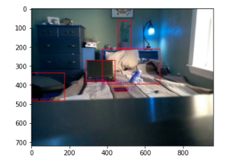
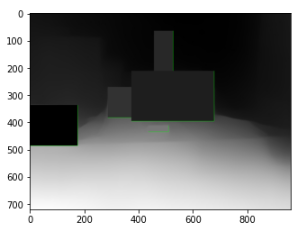

# drone-localization
DGMD S-17 Final Project
## Monocular drone (Tello) localization
2022 DGMD S-17 Robotics, Autonomous Vehicles, Drones, and Artificial Intelligence @ Harvard University Extension School

**Team Members:** Daniel Lebedinsky, Claire Peters, Yangsoo Song, John Ward

Setup
---

Prerequisites:
- [earthly](https://earthly.dev/get_earthly)
- [docker](https://docker.com)

In the repo, run the following commands:
```
$ earthly +docker
$ ./run-notebook.sh
```

Use the http://127.0.0.1:8890 address that comes up to access jupyter in your browser.
At this point, you can connect to Tello via wifi and control Tello from a notebook.

For example usage, open the `localizer.ipynb` notebook.

Proposal
---
#### https://docs.google.com/document/d/1O5AGPdEM5yHExTr-1Uiikc-4K_LPvO8e1A04pVEgl_Y/edit

Videos / Presentation
---
#### https://www.youtube.com/watch?v=NTBuCxX9tlA

Report
---
#### https://docs.google.com/document/d/1SZOcqcu_vET3Nv1ERcdWgQcP3W2ia9YvJJeHt1oc_AI/edit

# Documentation

Getting Started - MacOS (x86-64 & ARM)
---
####

1. Clone the repo:

```
$ git clone git@github.com:yangsoosong/drone-localization.git
```

2. Make sure homebrew's installed. If not,

```sh
$ /bin/bash -c "$(curl -fsSL https://raw.githubusercontent.com/Homebrew/install/HEAD/install.sh)"
```

3. Make sure Docker Desktop's installed. If not,

```
$ brew install --cask docker
```

4. Open Docker.app. Wait for it to start up, and allow privileged access and provide your password if prompted.

5. Generate PAT token -> [instruction](https://docs.github.com/en/enterprise-server@3.4/authentication/keeping-your-account-and-data-secure/creating-a-personal-access-token)

6. Run below command to access docker container
```
echo TOKEN_HERE | docker login ghcr.io -u USERNAME --password-stdin
```

7. Run `./run-notebook.sh` in the project directory (for example, `~/drone-localization`).

8. Copy the http://127.0.0.1:8890 URL and paste it into a browser to open Jupyter Lab.

See https://docs.github.com/en/packages/working-with-a-github-packages-registry/working-with-the-container-registry#authenticating-to-the-container-registry
if you are having access issue

Getting started - Linux
---
####

These steps will work for any Linux distribution with systemd.
1. Install Docker Desktop, Earthly, and jupyter lab.
2. In your system terminal, run `sudo usermod -a -G docker $USER`, then reboot.
3. run `sudo systemctl restart docker`, then run `docker ps` to verify that docker is working. You should see a list in all caps starting with "CONTAINER ID".
4. run `earthly +docker && ./run-notebook.sh` in the main branch of the project directory.
5. This will start a length installation process (about 20 minutes). At the end, you may be prompted to reboot. If so, repeat step 3 and run `./run-notebook.sh` in the project directory again.
6. Copy the URL output, paste it into a browser. This will open a jupyter lab.

Detection and Depth Localizer notebook
---
####
Results of Detection: \


Taking the bounding boxes from Detection, and averaging the depth field values within them: \


To create the localizer notebook with the detection and depth combined analysis, I had to import the detection and depth files in the beginning, which are included in the environment. \
Unfortunately, do to an indeterminate bug in either my system or the docker environment, I was not able to fly the drone while recording. Despite various attempts to change file permissions and the container setup, I kept getting the message "Notebook localizer.ipynb is not trusted" \
The detection and depth analysis in localizer_cv.ipynb was performed on still frames after they were taken from the drone. If there was more time for this project, the next step would have been to analyze the photos as they were being taken during the flight of the drone, and estimate the distance from the drone to various objects. \
